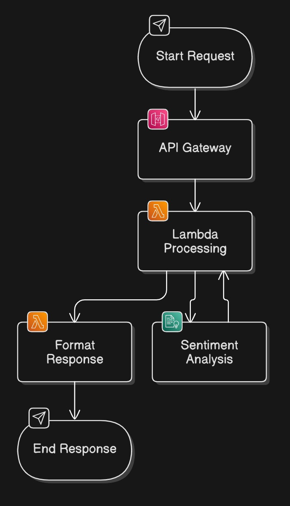

# Let’s Deploy a Serverless Sentiment Analysis API using AWS Lambda & API Gateway 🚀

Step by step ↓

AWS Lambda + API Gateway is one of the easiest ways to deploy an ML-powered REST API without managing servers.
Yet, many ML engineers hesitate to use it due to deployment complexity.

Let me help you deploy your first Serverless AI API using AWS Comprehend for sentiment analysis!

👉 Why AWS Lambda + API Gateway?
- ✅ Fully managed (no servers to maintain)
- ✅ Cost-efficient (pay only for what you use)
- ✅ Auto-scalable (handles thousands of requests)



## Overview
`lambda-api-sentiment` is a serverless application built using AWS Lambda and Amazon Comprehend to analyze the sentiment of text inputs. The application exposes an API endpoint that accepts text data and returns the sentiment analysis result.

## Features
- **Serverless Architecture**: Utilizes AWS Lambda for scalable and cost-effective execution.
- **Sentiment Analysis**: Leverages Amazon Comprehend to determine the sentiment of the provided text.
- **REST API**: Provides a RESTful API endpoint for easy integration with other applications.

## Prerequisites
- AWS Account
- AWS CLI configured with appropriate permissions
- Python 3.10 or higher
- Install uv
- `boto3` and `requests` Python packages

## Installation
1. Clone the repository:
    ```sh
    git clone https://github.com/Rohitjakkam/lambda-api-sentiment.git
    cd lambda-api-sentiment
    ```
2. Initialize uv
   ``` sh
   uv init
   ```
2. Install the required dependencies:
    ```sh
    uv sync
    ```

## Configuration
1. Update the  variable in  with your API Gateway endpoint URL.

## Usage
### Deploying the Lambda Function
1. Create a deployment package:
    ```sh
    zip -r lambda_function.zip lambda_function.py
    ```

2. Deploy the Lambda function using AWS CLI:
    ```sh
    aws lambda create-function --function-name sentimentAnalysis \
        --zip-file fileb://lambda_function.zip --handler lambda_function.lambda_handler \
        --runtime python3.10 --role arn:aws:iam::<your-account-id>:role/<your-lambda-role>
    ```

### Testing the API
1. Run the  script to test the API:
    ```sh
    python testing_api.py
    ```

2. You should see a JSON response with the sentiment analysis result.

## Example
### Request
```json
{
    "text": "I regret buying this laptop; it keeps freezing and the battery drains too fast."
}
```
### Response
```
{
    "sentiment": "NEGATIVE"
}
```

### Files
* lambda_function.py: Contains the AWS Lambda function code.
* testing_api.py: Script to test the API endpoint.
* payload.json: Example payload for testing.
* response.json: Example response from the API.
* pyproject.toml: Project configuration file.
* .gitignore: Git ignore file.
* LICENSE: License file.

### License
This project is licensed under the MIT License - see the LICENSE file for details.
